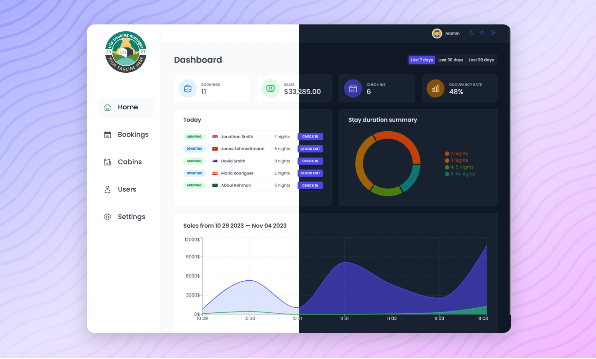

<div align="center">

  

  <h2>Hotel management app</h2>

  <hr>

</div>

<!-- Badges -->

<!-- Brief -->
<p align="center">
Hotel management app is a full-featured React web application that allows hotel employees to manage cabins, bookings, and guests. The app uses NodeJS and MongoDB for its backend and implements React techniques, such as HOCs, the Compound Component Pattern, and React Query.
</p>

<!-- Screenshot -->



</a>

## Table of contents

- [Key Features](#key-features)
- [My process](#my-process)
  - [Built with](#built-with)
- [Installation](#installation)

## Key Features

- The application caters to hotel employees as its primary users, necessitating authentication to access its functionalities.

- Registration for new users is exclusively facilitated within the application, ensuring that only legitimate hotel employees are granted accounts.

- Users are empowered to personalize their profiles by uploading avatars, as well as modifying their names and passwords.

- A comprehensive table view is implemented to showcase all cabins, featuring pertinent details such as cabin photo, name, capacity, price, and prevailing discount.

- Users are facilitated with the capability to update, delete, or create new cabins, complete with the option to upload corresponding photos.

- Another crucial aspect of the application is the provision of a table view encompassing all bookings, displaying arrival and departure dates, status, paid amount, alongside cabin and guest particulars.

- Booking statuses encompass "unconfirmed," "checked in," or "checked out," with the table offering filter options based on these statuses.

- Additional booking data includes guest count, duration of stay, guest observations, and breakfast booking status and price.

- Users are endowed with the authority to delete bookings, check guests in or out upon arrival.

- Payments for bookings may not have been completed upon guest arrival, hence necessitating users to accept payment externally and subsequently confirm receipt within the application.

- Guests are afforded the convenience of adding breakfast for the entirety of their stay during check-in, if not previously selected.

- Guest information comprises full name, email, national ID, nationality, along with a country flag for streamlined identification.

- The app's primary interface is designed as a dashboard, presenting vital information spanning the last 7, 30, or 90 days:

- A roster of guests checking in and out on the current day, with seamless task execution capabilities.

- Statistical insights into recent bookings, sales, check-ins, and occupancy rates.

- Visual representations, including a chart depicting daily hotel sales encompassing both total revenue and additional sales (currently limited to breakfast).

- Analytics showcasing stay durations, a pivotal metric for the hotel's operations.

- Users retain the flexibility to define application-wide settings, encompassing breakfast pricing, minimum and maximum nights per booking, as well as maximum guests per booking.

- Dark mode functionality is integrated to enhance user experience in low-light environments.

### Built with

- React
- MongoDB
- Nodejs, ExpressJS
- React Query
- React Router
- React Hook Form
- React Hot Toast
- Recharts
- Styled Components
- Vite

### Installation

- Clone this repo:

```sh
git clone https://github.com/username/Booking-manager.git
```

- Install dependencies:

```sh
npm install
```

- Build command:

```sh
npm run build
```

- Live server:

```sh
npm run dev
```
